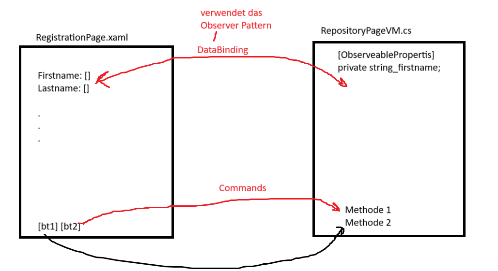

# SWP_CSharp_5BHWII
Hier sind die Projekte des 5. Jahres von SWP_CSharp_5BHWII


# MAUI 

## MAUI - Multiplatform App User Interface

MAUI (Multiplatform App UI) ist ein Framework von Microsoft, das es Entwicklern ermöglicht, plattformübergreifende Anwendungen mit einer einzigen Codebasis zu erstellen. Es basiert auf .NET und ermöglicht die Entwicklung von Anwendungen für Android, iOS, macOS und Windows. MAUI vereinfacht den Entwicklungsprozess, indem es eine einheitliche API und Projektstruktur bietet, wodurch die Notwendigkeit entfällt, separate Projekte für jede Plattform zu erstellen und zu verwalten.

## MVVM 

-> Model-View-ViewModel
Model - C#-Klassen, die die Daten und Geschäftslogik der Anwendung enthalten.
View - XAML-Dateien, die die Benutzeroberfläche der Anwendung definieren.
ViewModel - C#-Klassen, die die Verbindung zwischen Model und View herstellen und die Logik enthalten, die für die Interaktion zwischen den beiden erforderlich ist.




alles wird Quasi Automatisch in die View übertragen, wenn sich etwas im ViewModel ändert. (Dynamische Daten)

## XAML

XAML (eXtensible Application Markup Language) ist eine deklarative Markup-Sprache von Microsoft, die verwendet wird, um Benutzeroberflächen in .NET-Anwendungen zu definieren. In MAUI wird XAML verwendet, um die Layouts und das Erscheinungsbild von plattformübergreifenden Anwendungen zu beschreiben.

### Verwendung von XAML in MAUI

In MAUI können Entwickler XAML-Dateien erstellen, um die Benutzeroberfläche ihrer Anwendungen zu definieren. Diese XAML-Dateien enthalten Tags, die verschiedene UI-Elemente wie Buttons, Labels und Layouts repräsentieren. Der Code-Behind in C# wird verwendet, um die Logik und das Verhalten der UI-Elemente zu implementieren.

Beispiel einer einfachen XAML-Datei in MAUI:

```xml
<ContentPage xmlns="http://schemas.microsoft.com/dotnet/2021/maui"
             xmlns:x="http://schemas.microsoft.com/winfx/2009/xaml"
             x:Class="MyApp.MainPage">

    <StackLayout>
        <Label Text="Welcome to MAUI!"
               VerticalOptions="CenterAndExpand" 
               HorizontalOptions="CenterAndExpand" />
        <Button Text="Click Me"
                VerticalOptions="CenterAndExpand"
                HorizontalOptions="CenterAndExpand"
                Clicked="OnButtonClicked" />
    </StackLayout>

</ContentPage>
```

In diesem Beispiel definiert die XAML-Datei eine einfache Benutzeroberfläche mit einem Label und einem Button. Die Logik für den Button-Klick wird in der zugehörigen C#-Datei implementiert.


## Observer Pattern

Das Observer-Pattern ist ein Entwurfsmuster, das verwendet wird, um eine Abhängigkeit zwischen Objekten herzustellen, sodass Änderungen an einem Objekt automatisch an andere Objekte weitergegeben werden. In MAUI wird das Observer-Pattern häufig verwendet, um die Kommunikation zwischen ViewModel und View zu ermöglichen.

