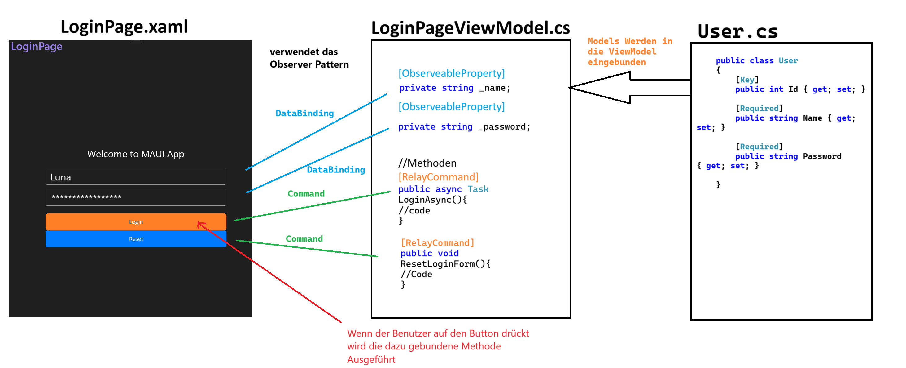

# 1.3. Architekturmuster: MVVM (Model-View-ViewModel)

Das Architekturmuster MVVM (Model-View-ViewModel) wird vor allem in der Entwicklung von MAUI (Multi-platform App UI) verwendet. Es trennt die Logik der Anwendung (Model) klar von der Darstellung (View) und ermöglicht eine saubere Trennung von Verantwortlichkeiten. Dies erleichtert die Wartbarkeit und Testbarkeit des Codes.

## Einführung in MVVM

Das MVVM-Muster (Model-View-ViewModel) ist ein Architekturansatz, der besonders in der Entwicklung von Desktop- und mobilen Anwendungen verwendet wird. Es unterstützt eine klare Trennung der Verantwortlichkeiten zwischen Benutzeroberfläche und Anwendungslogik.

### Komponenten von MVVM

- **Model (M):**  
  Das Model stellt die Daten und Geschäftslogik dar. Es enthält keine Informationen zur Benutzeroberfläche und ist unabhängig von der Darstellung. Es enthält zum Beispiel Datenbankabfragen, Validierungen und wird in C#-Klassen definiert.

- **View (V):**  
  Die View ist die Benutzeroberfläche (Buttons, Layout, Textfelder). In MAUI wird sie typischerweise mit XAML (Extensible Application Markup Language) erstellt.

- **ViewModel (VM):**  
  Das ViewModel (C#-Klasse) vermittelt zwischen Model und View. Es enthält die Logik für die Darstellung und ist das Bindeglied für DataBinding.

**Wichtig:** Jeder dieser Teile ist in der Projektstruktur klar voneinander getrennt. Beispielsweise befinden sich alle Views in einem Ordner, alle ViewModels in einem anderen Ordner, etc.

### Dateistruktur

```
Projektordner
│   App.xaml
│   App.xaml.cs
│
└───Views
│   │   NamePage.xaml
│   │   MainPage.xaml.cs
│   │   ...
│
└───ViewModels
│   │   MainPageViewModel.cs
│   │   ...
|
└───Models
|   │   UserDataModel.cs
|   │   ...
|
| ...
```


## 1.2.  MVVM in MAUI

In einem MAUI-Projekt wird MVVM durch folgende Elemente unterstützt:

- **XAML für die View (Benutzeroberfläche):**  
  Definiert das Layout und die visuellen Komponenten der Anwendung.

- **BindingContext in der View:**  
  Verweist auf ein ViewModel, das die Daten und Logik bereitstellt.

- **DataBinding:**  
  Synchronisiert Daten zwischen View und ViewModel. Änderungen im ViewModel werden automatisch in der View angezeigt und umgekehrt.

- **Commands:**  
  Behandeln Benutzerinteraktionen, wie das Klicken auf Buttons, und verknüpfen diese mit Methoden im ViewModel.

## Vorteile von MVVM

- **Klare Trennung von Verantwortlichkeiten:**  
  MVVM ermöglicht eine klare Trennung zwischen der Benutzeroberfläche (View) und der Geschäftslogik (Model und ViewModel), was die Wartbarkeit und Testbarkeit des Codes verbessert.

- **Verbesserte Testbarkeit:**  
  Da die Logik im ViewModel und nicht in der View enthalten ist, kann sie leichter mit Unit-Tests getestet werden, ohne die Benutzeroberfläche zu laden.

- **Wiederverwendbare Komponenten:**  
  Die Trennung von View und ViewModel fördert die Wiederverwendung von Komponenten, da die Logik unabhängig von der spezifischen Benutzeroberfläche ist.

- **Flexibilität bei der Benutzeroberfläche:**  
  Änderungen an der Benutzeroberfläche können vorgenommen werden, ohne die zugrunde liegende Logik zu beeinflussen, da die View und das ViewModel durch DataBinding und Commands verbunden sind.

- **Bessere Code-Organisation:**  
  MVVM hilft, den Code in saubere, getrennte Schichten zu organisieren, was das Verständnis und die Wartung des Codes erleichtert.

## 2.7. DataBinding und Commands in MAUI

Data Binding und Commands sind wichtige Bestandteile des MVVM-Musters, da sie eine Verbindung zwischen der Benutzeroberfläche (View) und der Logik (ViewModel) herstellen.

### Data Binding

Mit Data Binding können Daten automatisch zwischen der UI und dem ViewModel ausgetauscht werden. Das bedeutet, wenn sich die Daten im ViewModel ändern, wird die Benutzeroberfläche automatisch aktualisiert.

**Beispiel in XAML:**

```xml
<!-- Textfeld für den Namen -->
<Entry Text="{Binding Username}" />

<!-- Button, der ein Command bindet -->
<Button Command="{Binding SaveRegistrationDataCommand}" />
```

### Commands

Commands werden genutzt, um Benutzeraktionen wie das Klicken auf einen Button an Logik im ViewModel zu binden. Durch Data Binding können Commands direkt mit UI-Elementen verbunden werden.

**Beispiel in C#:**

```csharp
public partial class RegistrationPageViewModel : ObservableObject
{
    [RelayCommand]
    public void SaveRegistrationData()
    {
        // Logik zum Speichern der Registrierungsdaten
    }
}
```

**Beispiel in XAML:**

```xml
<Button Text="Save" Command="{Binding SaveRegistrationDataCommand}" />
```

## DataBinding und Command-Binding in der View

### Binding Context setzen

Der Data Binding Kontext wird in der Code-Behind-Klasse der View gesetzt, indem der Konstruktor der Seite die Instanz des ViewModels erhält und diese an die Eigenschaft `BindingContext` der Seite bindet.

```csharp
public RegistrationPage(RegistrationPageViewModel vm)
{
    InitializeComponent();
    this.BindingContext = vm;
}
```

Dadurch weiß die View, welche Datenquelle sie für das Binding verwenden soll.

### Aufbau der Verbindung in XAML

In der XAML-Datei wird die Verbindung zwischen den UI-Elementen und den ViewModel-Properties durch `{Binding PropertyName}` hergestellt.

**Beispiele:**

- **Username wird an ein Entry-Feld gebunden:**

    ```xml
    <Entry Text="{Binding Username}" />
    ```

- **SaveRegistrationDataCommand wird an den Command eines Buttons gebunden:**

    ```xml
    <Button Command="{Binding SaveRegistrationDataCommand}" />
    ```

### Funktion des Bindings

- **Properties (z. B. Username):**  
  Änderungen in der UI (z. B. Eingaben im Entry) werden automatisch in die zugehörige Property des ViewModels übertragen (Two-Way Binding).

- **Commands (z. B. SaveRegistrationDataCommand):**  
  Klick-Events auf Buttons lösen die gebundenen Commands im ViewModel aus.

## Observer Pattern im MVVM

### Was sind Observer Patterns?

Observer Patterns beschreiben Subscribe-Modelle, bei denen bestimmte Objekte (Observer) auf Änderungen eines anderen Objekts (Subject) reagieren. Wenn sich der Zustand des Subjects ändert, werden alle Observer benachrichtigt und können entsprechend reagieren. Dadurch wird unnötiges ständiges Abfragen des Wertes vermieden.

**Beispiel Börsenkurs:**

- **Subject:** Börsenkurs
- **Observer:** Anleger

Wenn sich der Börsenkurs ändert, werden alle Anleger benachrichtigt und können entsprechend handeln. Die Anleger müssen nicht ständig den Kurs überprüfen, sondern werden automatisch informiert. Somit wird eine Überlastung des Systems vermieden, und der Code wird effizienter.

### Observer Pattern im MVVM

Das **Observer Pattern** ist ein wichtiger Bestandteil des MVVM-Musters. Es ermöglicht, dass Änderungen in den Daten (Model oder ViewModel) automatisch an die View weitergeleitet werden.

Man findet das Observer Pattern in MVVM in Form von:

- **RelayCommands:**  
  Damit kann man beispielsweise Buttons an bestimmte Methoden im ViewModel binden, um bestimmte Aktionen auszuführen.

- **ObservableProperty:**  
  Wenn ein Attribut mittels dieses Attributs deklariert wird, werden alle Änderungen, die in der View gemacht werden, automatisch in das ViewModel übertragen (und umgekehrt).

### Übersicht Observer Pattern


## Dynamische Datenbindung

Ein Schlüsselmerkmal des MVVM-Musters ist die **Datenbindung**:

- **Automatische Anzeige:**  
  Daten und Logik im **ViewModel** werden automatisch in der **View** angezeigt.

- **Automatische Aktualisierung:**  
  Änderungen im **Model** oder **ViewModel** werden automatisch in der Benutzeroberfläche aktualisiert. Dies wird durch das Observer Pattern ermöglicht.

- **Benutzermodifikation:**  
  Daten, die in der **View** vom Benutzer manipuliert werden (Eingabefelder, Buttons), werden automatisch in das **ViewModel** übertragen.


### ObservableProperty-Attribut

**Beispiel in C#:**

```csharp
public partial class RegistrationPageViewModel : ObservableObject
{
    // Property für den Namen
    // Mittels des ObservableProperty-Attributs wird die 
    // Datenbindung aktiviert und kann in der View verwendet werden.
    [ObservableProperty]
    private string _name;
}
```

Damit in der View auf die Daten zugegriffen werden kann, wird die Datenbindung in XAML definiert:

**Beispiel in XAML:**

```xml
<!-- Das xmlns:vm-Präfix verweist auf das ViewModel-Namespace -->
<!-- Danach muss man angeben, wo sich die ViewModels befinden -->
<ContentPage xmlns="http://schemas.microsoft.com/dotnet/2021/maui"
             xmlns:x="http://schemas.microsoft.com/winfx/2009/xaml"
             xmlns:vm="clr-namespace:MAUIBasics.ViewModels" 
             x:Class="MAUIBasics.Views.Registrierungsformular"
             Title="Registrierungsformular">

    <!-- BindingContext auf das ViewModel setzen -->
    <ContentPage.BindingContext>
        <vm:RegistrationPageViewModel/> <!-- ViewModel-Instanz -->
    </ContentPage.BindingContext>

    <!-- Weiterer XAML-Code -->

    <!-- Textfeld für den Namen -->	
    <Entry x:Name="NameEntry"
        Placeholder="Name"
        Text="{Binding Name}"
    />
</ContentPage>
```

- **Änderungen an Name im View:**  
  Werden automatisch im ViewModel aktualisiert.
  
- **Benutzereingabe:**  
  Der Benutzer kann den Namen im Textfeld eingeben, und die Eingabe wird automatisch im ViewModel gespeichert, ohne dass eine weitere Übergabe erforderlich ist.

## Commands im MVVM

**Commands** sind Aktionen, die in der Benutzeroberfläche ausgeführt werden können, z. B. durch Klicken auf einen Button. Im MVVM-Muster werden Commands verwendet, um die Interaktionen zwischen View und ViewModel zu steuern.

### Datenbindung von Commands

Die **Commands** in der UI werden mit Methoden im ViewModel verbunden. Damit wird die Logik der Anwendung von der Benutzeroberfläche getrennt.



### RelayCommand-Attribut

**Beispiel in C#:**

```csharp
public partial class RegistrationPageViewModel : ObservableObject
{
    // Command für einen Reset-Button, um alle Werte zurückzusetzen
    // Mittels des RelayCommand-Attributs wird die 
    // Datenbindung aktiviert und kann in der View verwendet werden.
    [RelayCommand]
    public void ResetRegistrationForm()
    {   
        this.Name = string.Empty;
        this.Password = string.Empty;
        this.Birthdate = DateTime.Today;
        this.Street = string.Empty;
        this.HouseNumber = string.Empty;
        this.PostalCode = string.Empty;
        this.City = string.Empty;
    }
}
```

**Beispiel in XAML:**

```xml
<!-- Button zum Zurücksetzen des Formulars -->
<Button Text="Reset"
        Command="{Binding ResetRegistrationFormCommand}" 
/>
<!-- Der ResetRegistrationFormCommand wird automatisch im ViewModel ausgeführt. -->
<!-- WICHTIG: Bei der Benennung muss "Command" angehängt werden. -->
<!-- [Teil des Namens aus dem ViewModel]Command -->
```

**INFO:**  
Mittels der Methoden können die Daten, die mit DataBinding übergeben wurden, manipuliert und auch in einer Datenbank gespeichert werden.


## Übersicht und Zusammenfassung

### Übersicht

- **Model:**  
  Daten und Geschäftslogik

- **View:**  
  Benutzeroberfläche

- **ViewModel:**  
  Verbindung zwischen Model und View

### Zusammenfassung der Vorteile

1. **Klare Trennung der Verantwortlichkeiten:**  
   - Die View enthält nur die Darstellung.
   - Die Logik und Daten sind im Model und ViewModel gekapselt.

2. **Testbarkeit:**  
   - Da die View vom ViewModel entkoppelt ist, kann die Logik unabhängig getestet werden.

3. **Flexibilität bei Änderungen:**  
   - Änderungen in der Benutzeroberfläche erfordern keine Anpassungen an der Geschäftslogik.

4. **Wiederverwendbarkeit:**  
   - Das ViewModel kann mit verschiedenen Views wiederverwendet werden.

