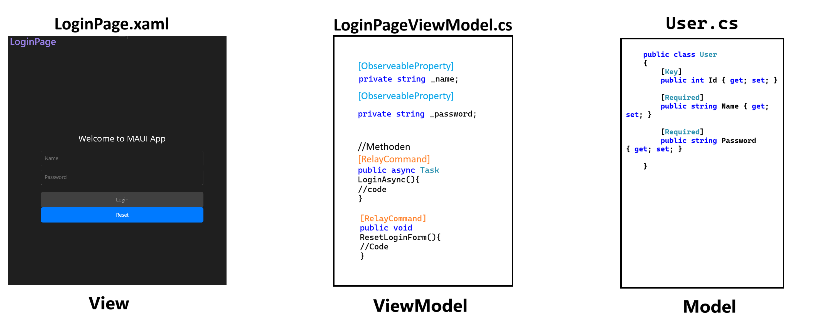
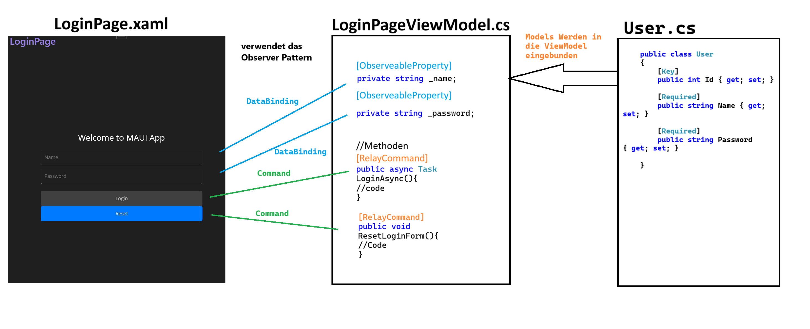
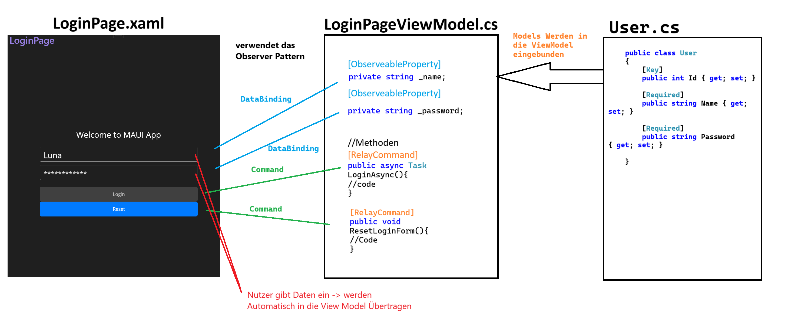
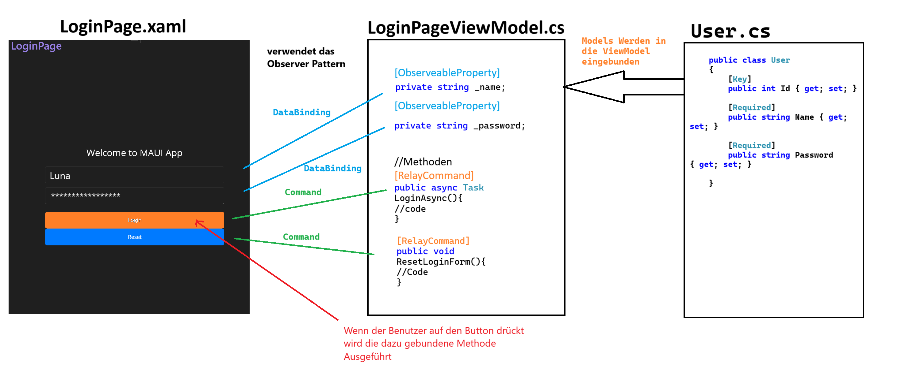
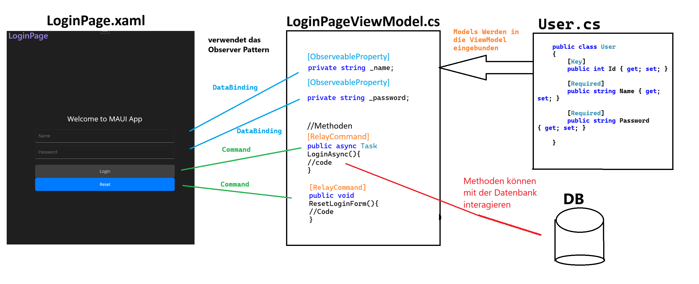

# Architekturmuster: MVVM (Model-View-ViewModel)

Das Architekturmuster MVVM (Model-View-ViewModel) wird vor allem in der Entwicklung von MAUI verwendet. Es trennt die Logik der Anwendung (Model) klar von der Darstellung (View) und ermöglicht eine saubere Trennung von Verantwortlichkeiten. Dies erleichtert die Wartbarkeit und Testbarkeit des Codes.


## Übersicht MVVM

**MVVM** steht für:
- **Model**: C#-Klassen, die die Datenstruktur und Geschäftslogik der Anwendung definieren. 
  - Das Model enthält auch Validierungen und speichert persistente Daten.
  - Beispiel: Datenbankabfragen, Datenoperationen.

- **View**: XAML-Dateien, die das UI (Benutzeroberfläche) definieren.
  - Hier wird festgelegt, wie Informationen angezeigt werden (z. B. Layout, Farben, Textfelder, Buttons).
  - Die View sollte möglichst keine Logik enthalten.

- **ViewModel**: C#-Klassen, die als Bindeglied zwischen Model und View dienen.
  - Enthält Logik, die die Darstellung der Daten und Benutzerinteraktionen handhabt.
  - Implementiert häufig das Observer Pattern (z. B. durch `RelayCommand`), um Änderungen im Model automatisch an die View zu übertragen.

**Wichtig**: Jeder dieser Teile ist in der Projektsstruktur klar voneinander getrennt und zum Beispiel alle Views sind in einem Ordner, alle ViewModels in einem anderen Ordner, etc.

Dateistruktur:
```plaintext
Projektordner
│   App.xaml
│   App.xaml.cs
│
└───Views
│   │   NamePage.xaml
│   │   MainPage.xaml.cs
│   │   ...
│
└───ViewModels
│   │   MainPageViewModel.cs
│   │   ...
|
└───Models
|   │   UserDataModel.cs
|   │   ...
|
| ...

```

Übersicht:
- **Model**: Daten und Geschäftslogik
- **View**: Benutzeroberfläche
- **ViewModel**: Verbindung zwischen Model und View




## Vorteile des MVVM-Musters

1. **Klare Trennung der Verantwortlichkeiten**: 
   - Die View enthält nur die Darstellung. Können von Designern erstellt werden.
   - Die Logik und Daten sind im Model und ViewModel gekapselt.

2. **Testbarkeit**:
   - Da die View vom ViewModel entkoppelt ist, kann die Logik unabhängig getestet werden.

3. **Flexibilität bei Änderungen**:
   - Änderungen in der Benutzeroberfläche erfordern keine Anpassungen an der Geschäftslogik.

4. **Wiederverwendbarkeit**:
   - Das ViewModel kann mit verschiedenen Views wiederverwendet werden.

5. **Aufteilen der Arbeit**1:
   - Die Views können von Designern erstellt werden, während Entwickler sich auf die Logik konzentrieren.


## Observer Pattern im MVVM

**Was sind Observer Patterns?**

Observer Patterns beschreiben Subscribe Modelle wo bestimmte Objekte (Observer) auf Änderungen eines anderen Objekts (Subject) reagieren. Wenn sich der Zustand des Subjects ändert, werden alle Observer benachrichtigt und können entsprechend reagieren. Somit wird unötiges dauerntes Abfragen des wertes vermieden. 

**Beispiel Börsenkurs:**

- **Subject**: Börsenkurs
- **Observer**: Anleger

Wenn sich der Börsenkurs ändert, werden alle Anleger benachrichtigt und können entsprechend handeln. Die Anleger müssen nicht ständig den Kurs überprüfen, sondern werden automatisch informiert. Somit wird eine Überlastung des Systems vermieden, und der Code wird effizienter.

**Observer Pattern im MVVM:**

Das **Observer Pattern** ist ein wichtiger Bestandteil des MVVM-Musters. Es ermöglicht, dass Änderungen in den Daten (Model oder ViewModel) automatisch an die View weitergeleitet werden. (oder umgekehrt)

Man findet das Observer Pattern in MVVM in Form von:
- **RelayCommands**: Damit kann man zum Beispiels Buttons an bestimmte Methoden in der ModelView binden. Um bestimmte Aktionen auszuführen.
- **ObservableProperty**: Wenn ein Attribut mittels diesem Attribut deklariert wird, werden alle änderungen die in der View gemacht werden automatisch in der ModelView übertragen. (Kann auch umgekehrt sein)

### Übersicht Observer Pattern




## Dynamische Datenbindung

Ein Schlüsselmerkmal des MVVM-Musters ist die **Datenbindung**:
- Daten und Logik im **ViewModel** werden automatisch in der **View** angezeigt.
- Änderungen im **Model** oder **ViewModel** werden automatisch in der Benutzeroberfläche aktualisiert. 
  Dies wird durch das Observer Pattern ermöglicht.
- Daten die in der **View** vom Benutzer manipuliert werden (Eingabefelder, Buttons) werden automatisch in das **ViewModel** übertragen.



### ObservableProperty-Attribut

**Beispiel:**
```csharp
    public partial class RegistrationPageViewModels : ObservableObject
    {
        // Property für den Namen
        // Mittels des ObservableProperty-Attributs wird die 
        // Datenbindung aktiviert und kann in der View verwendet werden.
        [ObservableProperty]
        private string _name;
    }

```

Damit in der View auf die Daten zugegriffen werden kann, wird die Datenbindung in XAML definiert:
```xml

<!-- Das xmlns:vm-Präfix verweist auf das ViewModel-Namespace -->
<!-- Dannach muss man angeben wo sich die ViewModels befinden -->
<ContentPage xmlns="http://schemas.microsoft.com/dotnet/2021/maui"
             xmlns:x="http://schemas.microsoft.com/winfx/2009/xaml"
             xmlns:vm="clr-namespace:MAUIBasics.ViewModels" 
             x:Class="MAUIBasics.Views.Registrierungsformular"
             Title="Registrierungsformular">

    <!-- BindingContext auf das ViewModel setzen -->
    <ContentPage.BindingContext>
        <vm:RegistrationPageViewModels/> <!-- ViewModel-Instanz -->
    </ContentPage.BindingContext>

    <!-- Weiterer XAML-Code -->

    <!-- Textfeld für den Namen -->	
    <Entry x:Name="NameEntry"
        Placeholder="Name"
        Text="{Binding Name}"
    />
```
- Änderungen an `Name` im View werden automatisch im ViewModel aktualisiert.
- Der Benutzer kann den Namen im Textfeld eingeben, und die Eingabe wird automatisch im ViewModel gespeichert, und muss nicht nocheinmal 
übergeben werden.

## Commands im MVVM

**Commands** sind Aktionen, die in der Benutzeroberfläche ausgeführt werden können, z. B. durch Klicken auf einen Button. Im MVVM-Muster werden Commands verwendet, um die Interaktionen zwischen View und ViewModel zu steuern.
**Datenbindung** die Commands (Aktionen) in der UI werden mit Methoden im ViewModel verbunden. Damit wird die Logik der Anwendung von der Benutzeroberfläche getrennt.



### RelayCommand-Attribut

**Beispiel:**
```csharp
    public partial class RegistrationPageViewModels : ObservableObject
    {
        // Command für einen Reset-Button um alle werte zurückzusetzen
        // Mittels des RelayCommand-Attributs wird die 
        // Datenbindung aktiviert und kann in der View verwendet werden.
        [RelayCommand]
        public void ResetRegistrationForm()             // Der ResetRegistrationForm-Command wird im ViewModel implementiert.
        {   
            this.Name = string.Empty;
            this.Password = string.Empty;
            this.Birthdate = DateTime.Today;
            this.Street = string.Empty;
            this.HouseNumber = string.Empty;
            this.PostalCode = string.Empty;
            this.City = string.Empty;
        }
    }

```

In der View wird das Command an einen Button gebunden:
```xml
    <!-- Button zum Zurücksetzen des Formulars -->
    <Button Text="Reset"
            Command="{Binding ResetRegistrationFormCommand}" 
    />
    <!-- Der ResetRegistrationFormCommand wird automatisch im ViewModel ausgeführt. -->
    <!-- WICHTIG: Bei der bennenung muss Command angehängt werden. -->
    <!-- [Teil des Namens aus dem ViewModel]Command -->
```

**INFO**: Mittels den Methoden kann man dan die Daten die in mit Databinding übergeben wurden manipulieren und auch in einer Datenbank speichern.



## Weiterführende Informationen

1. **Offizielle Microsoft-Dokumentation zu MVVM**  
   [MVVM in WPF - Microsoft Docs](https://learn.microsoft.com/en-us/dotnet/desktop/wpf/data/data-binding-overview?view=netdesktop-7.0)

2. **Design Patterns**  
   [Observer Pattern - Refactoring Guru](https://refactoring.guru/design-patterns/observer)

3. **Blogartikel und Tutorials zu MVVM**  
   [What is MVVM? - Simple Talk](https://www.red-gate.com/simple-talk/development/dotnet-development/what-is-mvvm/)

## Fazit

Das MVVM-Muster erleichtert die Trennung von Logik und Darstellung und macht Anwendungen dadurch wartbarer, testbarer und flexibler. Die dynamische Datenbindung ist ein Schlüsselkonzept, das durch das Observer Pattern ermöglicht wird, und sorgt für eine effiziente Synchronisierung zwischen Model, ViewModel und View.